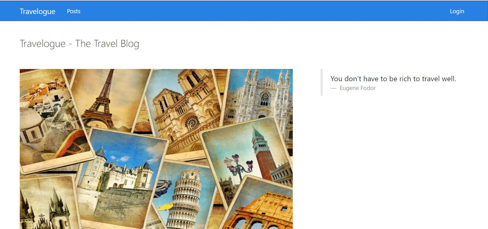
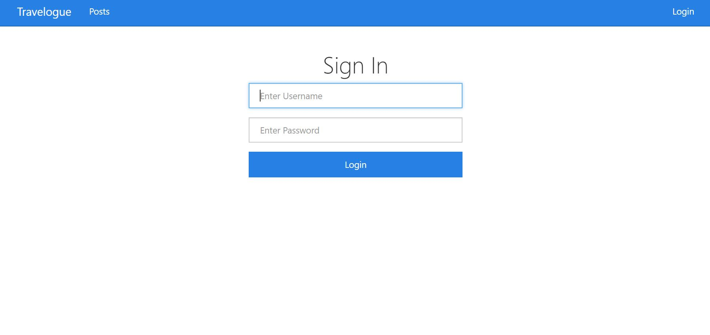
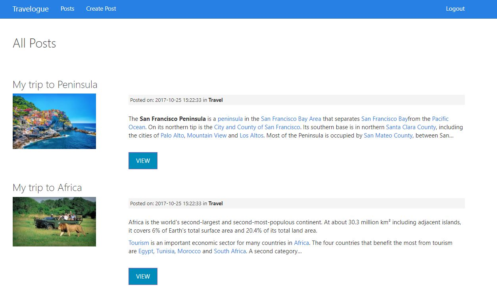
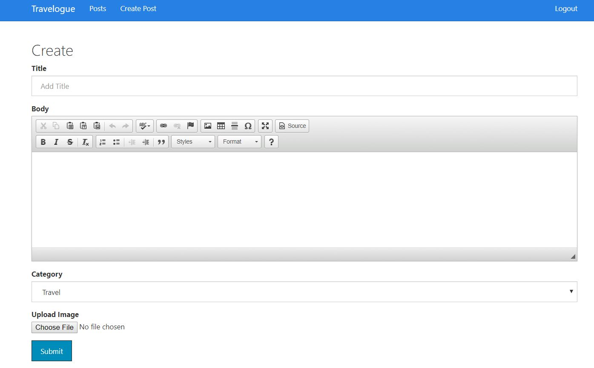

# AWS Cloud Project
AWS Cloud Project -Travelogue application 

# CMPE281Project1

    University Name: http://www.sjsu.edu/
    Course: Cloud Technologies
    Professor: Sanjay Garje
    ISA: Divyankitha Urs
    Student: Vidya CN
    Linkedin url : www.linkedin.com/in/vidya-n-

## About App:
The application called travelogue creates a blog for people who want to share their travel experience. It is hosted on amazon cloud. It leverages numerous cloud services like EC2, ELB, RDS, LAMBDA, S3, CLOUDFRONT to make it highly available and scalable. Developed using PHP, CodeIgniter.

## Features offered:
Once the user logins to travelogue, he can perform following operations:

    Creating a blog post, adding image to the post, updating the post, deleting post, viewing all posts etc. 
    The images are stored in the cloud using AWS Simple Storage Service. 
    The data related to Blog Posts are stored in RDS MYSQL database
    Features like comments for user activity will be integrated in the future.
    Each user can view posts from other users, but cannot update/delete others posts, images etc.

## Pre-requisites for running this project on local

###  Softwares that needs to be installed:
        • PHP 5.6 or later,APACHE 2.2 or later downloaded and installed on local machine
        • Apache downloaded and installed on local machine
        • Git downloaded and installed
        • AWS SDK for PHP 

### Cloud Resources that needs to be created before running this application on local machine
        • S3 bucket.
        • Cloudfront for the S3 bucket that is created.
        • MYSQL RDS server with single AZ for database
        • IAM user that has get/put/delete access on the bucket created.

## Running the project from local
        • Download AWS PHP SDK.
        ### Running core server:
        Download the source code from github
        Copy the folder containing the source code to the Apache htdocs folder
        Run dbscripts
        Give the RDS MYSQL connection parameters in the db config file.
        Open a web browser like Chrome, type http://localhost/FOLDERNAME to view the front end of the application.
        The app should be up and running.
        
## Architecture

            
## Home Page

## Login window

## Home  page after login

## Upload screen

## Update screen

